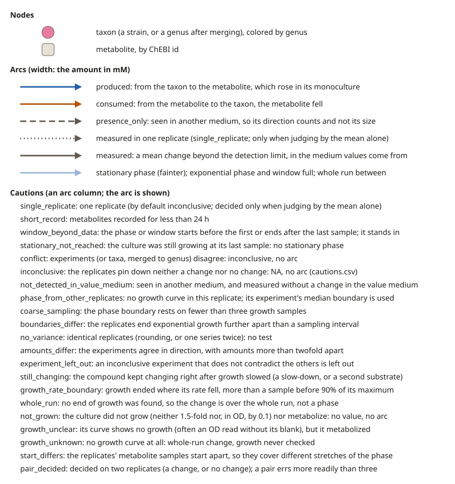

# foodnet: who produces and who consumes which metabolite

[](https://github.com/hallucigenia-sparsa/foodnet/actions/workflows/ci.yml)
[](LICENSE)
[](pyproject.toml)

food**net** builds bipartite taxon and metabolite networks from the batch monocultures in
[mGrowthDB](https://mgrowthdb.gbiomed.kuleuven.be/): which taxon produces which compound, and which consumes
it, with the amount moved in each growth phase. It hands the result to Cytoscape, to graph formats, to two
matrix formats, and to R as the parameters of a consumer-resource model (CRM), with
[miaSim](https://bioconductor.org/packages/release/bioc/html/miaSim.html) as the example simulator.

It is the sister tool of [grow**net**](https://github.com/crossfeed-bio/crossfeed), which builds
interaction networks from co-cultures, and is built the same way: a thin client with no runtime
dependencies, a local page and a command line, nothing hosted and nothing uploaded.

## Contents

- [Install](#install)
- [Quickstart](#quickstart)
- [What it does](#what-it-does)
- [The outputs](#the-outputs)
- [Consumer-resource models in R](#consumer-resource-models-in-r)
- [The command line](#the-command-line)
- [Guardrails](#guardrails)
- [License](#license)

## Install

With [uv](https://docs.astral.sh/uv/), which fetches a suitable Python by itself:

```bash
uv tool install foodnet
```

or with pipx (`pipx install foodnet`), or from a clone (`pip install -e .`). Each release also carries
`foodnet-<version>-windows.zip`, the whole program in one folder with Python included: unzip it and
double-click `foodnet.exe`. Windows warns about a program few people have run yet; click the small "More
info" link, then "Run anyway".

## Quickstart

```bash
foodnet gui
```

opens the page in your browser. Type taxa in the first box (a species, a strain, a genus or an NCBI taxon
id, one per line), or press Example, and press Get taxon-metabolite network. The arcs appear under the settings, with
the downloads above them.



## What it does

1. **Taxa to monocultures.** Names resolve to the strains mGrowthDB holds (a species name to all its
   strains). food**net** reads every batch monoculture of those strains that has metabolite measurements.
   A culture-level growth curve counts in a monoculture, since it measures the one strain.
2. **Growth phases.** Exponential growth ends at the first sample where the culture reaches 90% of its
   maximal abundance; the stationary phase runs from there to the last metabolite sample. Below the boxes,
   choose Exponential phase (the default), Stationary phase or Both. A time window in Advanced settings
   replaces the phases. Diauxic shifts are not detected.
3. **A change per phase.** For each replicate and metabolite, the concentration at the end of the phase
   minus the concentration at its start (interpolated between samples), averaged over replicates. A mean
   change below the detection limit (0.2 mM, a setting) is no change. A metabolite series shorter than
   24 h is used, and flagged.
4. **Values from one medium, presence from the others.** The values come from the medium that holds data
   for the most taxa, or from the media, experiments or studies named in the second box. Every other medium
   only says whether a compound was produced or consumed: those arcs are `presence_only` and their matrix
   cells NA. A study or experiment id in the second box is a limit instead: only those are read.
   "Ignore media differences" pools every medium; "Report everything as booleans" drops the amounts.
5. **Pooling, with what does not agree reported.** Studies in the value medium are pooled. Experiments
   that disagree on what happened make a `conflict`, named in the report. The same experiment deposited
   under two studies is counted once.
6. **Arcs.** A produced arc runs from the taxon to the metabolite, a consumed arc from the metabolite to
   the taxon, and its width is the amount in mM. One arc per study by default; "Merge arcs across studies"
   and "Merge to genus" are advanced settings, as in grow**net**.

Acid and base forms of one compound are one metabolite (acetic acid and acetate), since mGrowthDB records
both and an HPLC measures one pool. A compound that was never assayed for a taxon is never written as zero.
Every decision and its reason is in [docs/METHOD_NOTES.md](docs/METHOD_NOTES.md).

## The outputs

- **The matrices as an image**, shown first under the settings: consumed and produced side by side (or one
  above the other when they are wide), in the style of Figure 3c: a number on a gray for a change, white for
  measured without one, pale orange for not assayed, an open circle for a change seen only in another medium.
  Downloadable as SVG, and in the matrices zip.
- **Network**: JSON (the canonical format, [schema](schema/metabolite_network.schema.json)) or GraphML.
- **Taxa x metabolites matrix** (CSV): one cell per taxon and metabolite, the mean change in mM, positive
  when produced and negative when consumed.
- **Consumed and produced matrices** (zip): two matrices of non-negative amounts, an evidence matrix for
  each (`measured`, `below_limit`, `presence_only`, `not_assayed`), and a README.
- **Send to Cytoscape**: the network in a running Cytoscape, in the style of the legend. A downloaded
  GraphML takes the same style from `foodnet style`.
- **Report**: every setting, every arc, and every record left out with its reason.

Every arc also says how long its cultures grew exponentially (`exponential_h`, in hours), in the result
table and in every file.

In every matrix a number is a change beyond the detection limit, 0 is measured without one, and NA is no
value. With Both, each metabolite has a column per phase.

## Consumer-resource models in R

CRM mode collects growth rates: from the replicates whose metabolites gave the values, else from another
monoculture in the same medium. Get CRM parameters then downloads the matrices, the growth rates and the
initial medium concentrations, or sends them to R. Install the companion package once:

```r
remotes::install_github("hallucigenia-sparsa/foodnet", subdir = "r")
```

then:

```r
library(foodnet)
crm <- foodnet_listen()          # and press Send to R on the page
E <- crm_efficiency(crm)         # positive for consumption, negative for production
args <- as_miasim(crm)           # stops if a taxon has no growth rate
tse <- do.call(miaSim::simulateConsumerResource, c(args, list(t_end = 48, t_store = 100)))
```

The matrices are measured amounts, not model parameters: `crm_efficiency()` turns them into an efficiency
matrix, and how to scale it is a modeling choice. See [r/README.md](r/README.md).

## The command line

```bash
foodnet derive --taxa "Escherichia coli LF82" "Bacteroides fragilis" --out network.json --report report.txt
foodnet derive --taxa Roseburia --phase both --format matrices --out roseburia.zip
foodnet derive --taxa Blautia Roseburia --conditions "Wilkins-Chalgren" --crm-mode --crm crm.zip
foodnet validate network.json
```

`foodnet derive --help` lists every option, with examples.

## Guardrails

The same as grow**net**'s: no real data in git (only synthetic fixtures under `tests/fixtures/`), no
runtime dependencies, the network format is a contract checked against its schema, and `make check` runs
lint, the guardrail gate and the tests, in CI and before every commit. See [AGENTS.md](AGENTS.md) and
[CONTRIBUTING.md](CONTRIBUTING.md).

Every arc cites the studies behind it, so attribution resolves at the arc level; see
[docs/DATA_GOVERNANCE.md](docs/DATA_GOVERNANCE.md).

## License

Apache License 2.0; see [LICENSE](LICENSE) and [NOTICE](NOTICE).
